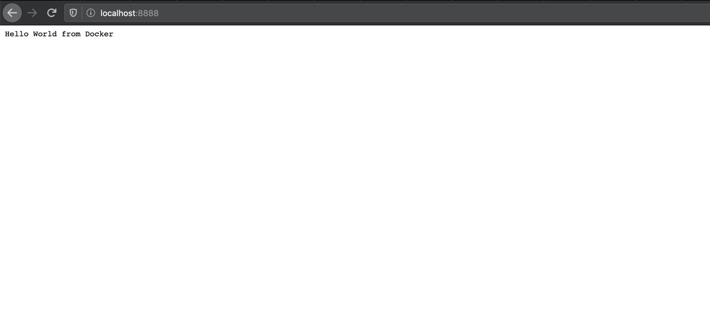
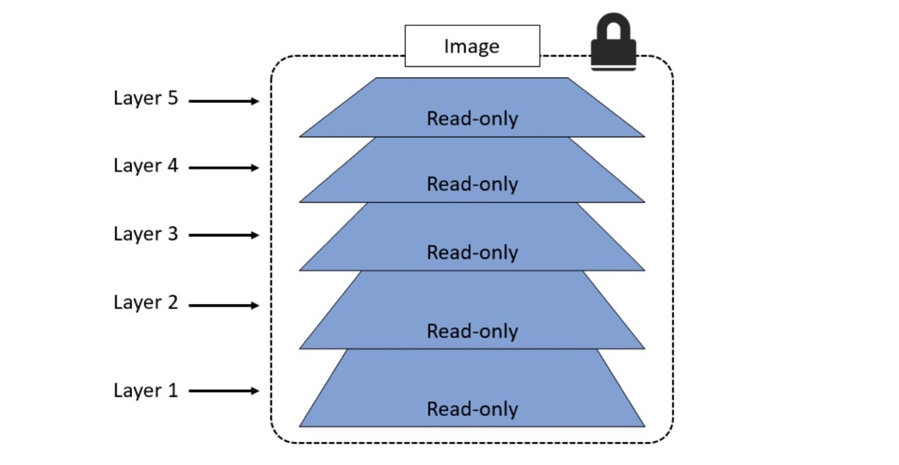

<p align="center">
  
</p>

This is just a simple demonstration to get a basic understanding of how Docker works while working step by step. I learned docker like this and made this repo to solve some problems that I faced during my learning experience so that it might help other beginners. Hope you enjoy learning. If you like it give it an ⭐ on [GitHub](https://github.com/championshuttler/docker-basicLearning) and [support](https://www.paypal.me/championshuttler) my work.

[](https://github.com/championshuttler/docker-basiclearning)

**Important:-** By seeing the size of readme you might have second thoughts but, to be honest, if you work from start you won't experience any problem and learn along the way.

<a href="https://www.buymeacoffee.com/championshuttler" target="_blank"></a>

[](https://saythanks.io/to/shivams2799@gmail.com)

## Contents

- [**Requirements**](#requirements)
- [**Docker**](#docker)
  - [What is docker?](#what-is-docker)
  - [What is a container?](#what-is-a-container)
  - [Why use container?](#why-use-containers)
- [**Getting Started**](#getting-started)
  - [Setting up your machine](#setting-up-your-machine)
  - [Writing your first Dockerfile](#writing-your-first-dockerfile)
  - [Building your Docker Images](#building-your-docker-images)
  - [Running the docker image](#running-the-docker-image)
  - [Understanding Docker images and image layers](#understanding-docker-images-and-image-layers)
  - [Using image tags effectively](#using-image-tags-effectively)
- [**Deploying Multi Container Apps with Docker Compose**](#deploying-multi-container-apps-with-docker-compose)]
  - [What is Docker Compose](#what-is-docker-compose)
  - [Deploying app with Docker Compose](#deploying-app-with-docker-compose)
- [**Give Feedback**](#give-feedback)
- [**References**](#references)
 

## Requirements

- You need to have [Docker](https://www.docker.com/) installed for your OS.
- You need to have [Docker Compose](https://docs.docker.com/compose/install/) installed for your OS.

## Docker

#### What is Docker?

Wikipedia defines Docker as
>  is a set of the platform as a service (PaaS) products that use OS-level virtualization to deliver software in packages called containers. Containers are isolated from one another and bundle their software, libraries, and configuration files; they can communicate with each other through well-defined channels. All containers are run by a single operating system kernel and therefore use fewer resources than virtual machines.

Docker helps you in deploying your applications more efficiently in a sandbox (called containers) to run on the host operating system i.e. Mac. The main advantage of docker is that it allows you to package software with all of its dependencies into a single standardized unit.

#### What is a Container?

The container is a solution for how to get the software to run without any problems when moved from one computing environment to another. This could be from a staging environment into production or maybe from a laptop to a different laptop with another operating system.

#### Why use containers?

Containers provide a logical packaging mechanism in which your applications can be abstracted from the environment in which they run. The major difference is that every container does not require its full-fledged OS. All containers on a single host sharing a single OS. This helps in frees up huge amounts of system resources such as CPU, RAM.

## Getting Started

#### Setting up your machine

Once you are done installing Docker, test your Docker installation by running the following:

```bash
docker run hello-world

Hello from Docker.
This message shows that your installation appears to be working correctly.
...
```

#### Writing your first Dockerfile

1. A `Dockerfile` is a text document that contains all the commands you could call on the command line to make an image. Create a file `hello.js` and copy this code into it. Here we wrote a simple JS code to show Hello World on `localhost:8888`.

```bash
var http = require("http");

http.createServer(function (request, response) {
   response.writeHead(200, {'Content-Type': 'text/plain'});
   response.end('Hello World\n');
}).listen(8888);

// Console will print the message
console.log('Server running at http://127.0.0.1:8888/');
```

2. Create a file named `Dockerfile` and copy this code into it.

```bash
FROM node:8 

LABEL maintainer="yourEmail@example.com"

RUN npm install

ADD hello.js /hello.js

EXPOSE 8888

ENTRYPOINT [ "node", "hello.js" ]
```

Even if this is the first Dockerfile you’ve ever seen, I’d say you could have a good guess what’s happening here. The Dockerfile instructions are FROM, ENV, LABEL, RUN , ADD , EXPOSE, and ENTRYPOINT; they’re in capitals but that’s a convention, not a requirement.

At a high-level, this Dockerfile gives instructions like Start with the node image, add `“championshuttler@gmail.com”` as the maintainer, run `npm install` to install dependencies, copy the file in the application code, document the app’s network port, and set hello.js as the default application to run.

#### Building your Docker Images

Now we will create a docker image in our local machine. Open your terminal in the current project's folder and run

```bash
docker build -t helloworld .
```

Here you’re telling Docker to build an image called `helloworld` based on the contents of the current directory (note the **dot (.)** at the end of the build command). Docker will look for the Dockerfile in the directory and build the image based on the instructions in the file.

#### Running the docker image

After building the docker image, the next step would be to run the image and see if it works:

```bash
docker run -p 8888:8888 helloworld
```

The command we just ran used port 8888 for the server inside the container and exposed this externally on port 8888. Head over to the URL with port 8888:

<p align="center">
  
</p>

Congrats! You have successfully created your first docker image.


#### Understanding Docker images and image layers

Docker images are like virtual machine templates and are used to start containers. Under the hood, they are made up of one or more read-only layers, that when stacked together, make up the overall image. Docker takes care of stacking these layers and representing them as a single unified object. **Note:** Docker Images are immutable means Docker images can’t ever change. Once you’ve made one, you can delete it, but you can’t modify it.

<p align="center">
  
</p>

The Docker image contains all the files you packaged, which become the container’s filesystem - and it also contains a lot of metadata about the image itself. That includes a brief history of how the image was built. You can use that to see each layer of the image, and the command that built the layer. You can check the history of `helloworld` image by using:

```bash
docker image history helloworld                                                                         
IMAGE               CREATED             CREATED BY                                      COMMENT
cb84eb33ca20        58 seconds ago      /bin/sh -c #(nop)  ENTRYPOINT ["node" "hello…  
7d652a817a9f        58 seconds ago      /bin/sh -c #(nop)  EXPOSE 8888              
334575e947c9        59 seconds ago      /bin/sh -c #(nop) ADD file:b9606ef53b832e66e…   
```

The `CREATED BY` commands are the Dockerfile instructions – there’s a one-to-one relationship, so each line in the Dockerfile creates an image layer.

#### Pushing your images to Docker Hub

First, you need to log in with your [dockerhub](https://hub.docker.com) account by 

```bash
docker login --username $dockerId
```

Now that you’re logged in, you can push images to your account or to any organizations you have access to. If you’re not a member of any organization, then you can only push images to repositories in your account.

We built a Docker image called `helloworld`. That image reference doesn’t have an account name, so we can’t push it to any registries. We don’t need to rebuild the image to give it a new reference though, images can have several references. Tag your image by like this:

```bash
docker image tag helloworld $dockerId/helloworld:v1
```

Now we have an image reference with our Docker ID in the account name, and we logged in to Docker Hub so we ready to share our image! The docker image push command is the counterpart of the pull command, it uploads our local image layers to the registry:

```bash
docker image push championshuttler/helloworld:v1                                           

The push refers to a repository [docker.io/championshuttler/helloworld]
9519a21ac374: Pushed
```

#### Using image tags effectively

We can put any string into a Docker image tag, and as we've already seen you can have multiple tags for the same image. We'll use that to version the software in our images and let users make informed choices for what they won't use - and to make our own informed choices when we use other people's images.

Many software projects use a numeric versioning scheme with decimal points to indicate how big a change there is between versions, and you can follow that with your image tags. The basic idea is something like [major].[minor].[patch], which has some implicit guarantees. A release that only increments the patch number might have bugfixes but should have the same features as the last version; a release which increments the minor version might add features but shouldn't remove any; a major release could have completely different features.


## Deploying Multi Container Apps with Docker Compose

#### What is Docker Compose

Most applications don't run in one single component. Even large old apps are typically built as front-end and back-end components, which are separate logical layers running in physically distributed components. Docker is ideally suited to running distributed applications - from n-tier monoliths to modern microservices. Each component runs in its lightweight container, and Docker plugs them together using standard network protocols. You define and manage multi-container apps like this using Docker Compose. Docker Compose is a tool for defining and running multi-container Docker applications. With Compose, you use a `YAML` file to configure your application’s services. Then, with a single command, we create and start all the services from your configuration.

Docker Compose file describes the desired state of your app - what it should look like when everything's running. It's a simple file format where you capture all the options you would put in your docker container run commands into the Compose file. Then you use the Docker Compose tool to run the app. It works out what Docker resources it needs - which could be containers, networks, or volumes - and sends requests to the Docker API to create them. The default name for the Compose YAML file is `docker-compose.yml`. However, we can use the **-f** flag to specify custom filenames.

Let's get started.

Below the code shows a very simple `Docker Compose` file that defines a small Flask app with two services (web-frontend and redis). The app is a simple web server that counts the number of visits and stores the value in Redis. 

```bash
version: "3.5"
services:
  web-frontend:
    build: .
    command: python app.py
    ports:
      - target: 8888
        published: 8888
    networks:
      - counter-net
    volumes:
      - type: volume
        source: counter-vol
        target: /code
  redis:
    image: "redis:alpine"
    networks:
      counter-net:

networks:
  counter-net:

volumes:
  counter-vol:
```

* The `version` key is necessary, and it should always the first line of the file. This explains the version of the `Compose file` format (basically the API).

* The top-level `services` key is where we define the different application services. The example we’re using defines two services; a web front-end called `web-frontend`, and an in-memory database called Redis. Compose will deploy each of these services as its container.

* The top-level `networks` key tells Docker to create new networks. By default, Compose will create bridge networks. These are single-host networks that can only connect containers on the same host.

Within the definition of the web-frontend service, we give Docker the following instructions:

* **build**: . This tells Docker to build a new image using the instructions in the Dockerfile in the current directory (.). The newly built image will be used to create the container for this service.
* **command**: python app.py This tells Docker to run a Python app called app.py is the main app in the container. The app.py file must exist in the image, and the image must contain Python. The Dockerfile takes care of both of these requirements.
* **ports**: Tells Docker to map port 5000 inside the container (-target) to port 5000 on the host (published). This means that traffic sent to the Docker host on port 5000 will be directed to port 5000 on the container. The app inside the container listens on port 5000.
* **networks**: Tells Docker which network to attach the service’s container to. The network should already exist or be defined in the network's top-level key. If it’s an overlay network, it will need to have the attachable flag so that standalone containers can be attached to it (Compose deploys standalone containers instead of Docker Services).
* **volumes**: Tells Docker to mount the counter-vol volume (source:) to /code (‘target:’) inside the container. The counter-vol volume needs to already exist, or be defined in the volumes top-level key at the bottom of the file.


#### Deploying an app with Docker Compose

We’ll deploy the app defined in the Compose file from the previous section. To do this, you’ll need the following 4 files from https://github.com/championshuttler/counter-app:

* Dockerfile
* app.py
* requirements.txt
* docker-compose.yml

Clone the Git repo locally.

```bash
git clone https://github.com/championshuttler/counter-app.git
```

Let’s quickly describe each file:
* `app.py` is the application code (a Python Flask app).
* `docker-compose.yml` is the Docker Compose file that describes how Docker should deploy the app.
* `Dockerfile` describes how to build the image for the web-frontend service.
* `requirements.txt` lists the Python packages required for the app.

Let’s use Compose to bring the app up. You must run all of these following commands from within the `counter-app` directory:

```bash
docker-compose up &
```

It’ll take a few seconds for the app to come up, and the output can be quite verbose.

With the application successfully deployed, you can point a web browser at your Docker host on `port 5000`and see the application in all its glory.

## Give Feedback

Did you find the tutorial to be a complete mess or did you have fun and learn something? Send in your thoughts directly to me or just create an issue. Find me on [Twitter](https://twitter.com/idkhtml) too, feel free to ask you have some doubts.

I would love to hear about your experience with this tutorial. Hope you enjoyed learning. If you like it please give it an ⭐ on [GitHub](https://github.com/championshuttler/docker-basicLearning) and [support](https://www.paypal.me/championshuttler) my work.

## References

* [Docker Deep Dive](https://leanpub.com/dockerdeepdive)
* [Docker Curriculum](https://docker-curriculum.com/)

## TODO
* Add Docker Volume Docs
* Add Docker container docs
* Add Docker swarm docs
* Add Docker Networking docs
* Add  Docker overlay networking docs
